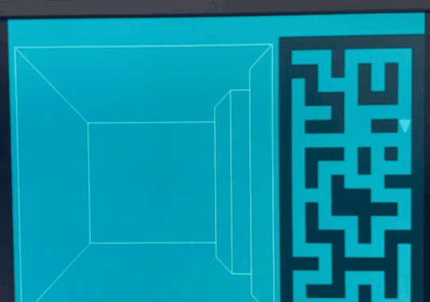

# Mazewar

**A first-person 3D maze game rendered entirely in hardware on a DE1-SoC FPGA.**

No CPU. No GPU. No soft core. Every pixel is produced by a state machine written in SystemVerilog, driving a 640×480 VGA display at 60 Hz — and the whole perspective renderer uses **zero DSP blocks**, because it does no multiplication or division at runtime.


<!-- MEDIA: demo GIF goes here. 5-8s loop, ~700px wide, <10MB so it autoplays inline.
     Show: walking down a corridor, turning a corner, minimap updating in sync. -->
<p align="center">
  
</p>

<p align="center"><em>▶ <a href="#">Full demo video</a></em></p>

---

## What it is

A hardware reimplementation of [Mazewar](https://en.wikipedia.org/wiki/Maze_War) — the 1973 game generally credited as the first first-person 3D shooter — built as a digital design course project on an Intel Cyclone V FPGA.

You walk through an 11×21 maze in first person. The view is drawn as true perspective-projected geometry, with a live top-down minimap beside it showing your position and facing. The original ran on Imlac minicomputers; this one runs on nothing but logic gates and block RAM.

The interesting part is *how* the 3D view is produced. A textbook raycaster casts one ray per screen column and divides to find each wall's projected height — 640 divisions per frame. Dividers are expensive in hardware. This design gets the same visual result with **no arithmetic beyond addition**, by precomputing the perspective projection into a 16-entry lookup table and drawing walls as run-length-merged quads. That single decision is why the design fits in 4% of the FPGA's logic and uses none of its 87 DSP blocks.

## Features

- **Perspective-projected first-person view** — corridors, corner openings, and end walls, all correctly foreshortened
- **Live 2D minimap** with a directional player marker
- **Grid-based collision detection** — walls block movement before the move commits
- **Four-way movement** — advance, reverse, and turn in place
- **Full-screen 640×480 framebuffer** at 9-bit color, refreshed at 60 Hz
- **Hardware drawing primitives** — Bresenham lines, filled rectangles, filled triangles, arbitrary quads
- **No multipliers, no dividers, no floating point** anywhere in the render path

## Hardware and controls

| | |
|---|---|
| **Board** | Terasic DE1-SoC |
| **FPGA** | Intel Cyclone V `5CSEMA5F31C6` |
| **Display** | VGA, 640×480 @ 60 Hz, 9-bit color (512 colors) |
| **Input** | PS/2 keyboard |
| **System clock** | 50 MHz (`CLOCK_50`); VGA pixel clock derived via PLL |

Connect a VGA monitor to the board's VGA port and a PS/2 keyboard to the PS/2 port.

| Control | Action |
|---|---|
| <kbd>W</kbd> | Move forward |
| <kbd>S</kbd> | Move backward |
| <kbd>A</kbd> | Turn left |
| <kbd>D</kbd> | Turn right |
| `SW[0]` | System reset (hold low to reset, high to run) |
| `SW[1]` | Reset player to the maze start position |

Movement is blocked by walls — attempting to walk into one leaves your position unchanged.

---

## How it works

### System architecture

<!-- MEDIA: export doc/TopLevelDiagram.drawio to SVG and place at doc/media/architecture.svg
     (SVG scales cleanly and reads correctly on both light and dark GitHub themes) -->
<p align="center">
  
</p>

Three blocks, one direction of data flow:

| Module | Responsibility |
|---|---|
| `player` | Holds position and facing. Decodes input, tests the target cell against the maze, commits the move only if it's free. |
| `draw_screen` | The renderer. An 11-state FSM that walks the maze and emits geometry — this is where the 3D view is produced. |
| `vga_adapter` | Framebuffer and VGA timing generation. Accepts `(x, y, color)` writes and drives the display. |

`player` publishes `px`, `py` and `direction`; `draw_screen` consumes them and streams pixel writes into the framebuffer. A frame is redrawn only when the player actually moves, so the renderer is idle most of the time.

### Rendering: perspective without arithmetic

The maze is a grid, and the player always stands on a cell facing one of four directions. That constraint is what makes the cheap approach possible: **every wall the player can ever see is at one of 16 discrete depths**, so every wall edge can only ever land at one of 16 screen positions.

Those 16 positions are precomputed and baked into a lookup table:

```systemverilog
parameter logic [12:0] Distance [0:15] = '{
    13'd35,  13'd65,  13'd90,  13'd111,   // depth 0-3
    13'd128, 13'd141, 13'd151, 13'd158,   // depth 4-7
    ...
};
```

The values crowd together as depth increases — that non-linear spacing *is* the perspective projection, evaluated once at design time instead of 640 times per frame. At runtime the renderer only ever indexes this table and adds offsets. No multiply, no divide, no floating point. **This is why the design consumes 0 of 87 DSP blocks.**

To draw a frame, the FSM:

1. **Clears the screen** and redraws the minimap, cell by cell.
2. **Measures corridor depth** — walks forward from the player until it hits a wall, recording how far the view extends.
3. **Walks the left wall.** Stepping outward from the player, it counts *runs* of consecutive same-type cells (wall or opening) rather than treating each cell separately. Each run becomes a single quad, its four vertices read straight out of the distance LUT. A run of five wall cells costs one quad, not five.
4. **Walks the right wall**, mirroring the same logic.
5. **Draws the viewport frame and the end wall** that terminates the corridor.

Run-length merging is what keeps the primitive count low enough to redraw the whole screen within the movement budget.

### The drawing primitives

Everything is built from one pixel-per-clock line engine:

| Primitive | Implementation |
|---|---|
| `draw_line` | Bresenham's algorithm (Zingl's integer formulation) — one pixel per clock, integer error accumulator only |
| `draw_rectangle_fill` | Scanline fill: iterates rows, emitting one horizontal line each |
| `draw_triangle_fill` | Used for the minimap's directional player marker |
| `draw_quad` | Four chained `draw_line` calls — the wall bands |

Each primitive is its own small FSM exposing a uniform `start` / `busy` / `done` handshake, so `draw_screen` composes them without caring how long any one takes.

### Collision detection

The maze is stored as a packed bit array — 21 rows of 11 bits, one bit per cell. Because the player only ever moves one cell along one axis, collision detection is a single array lookup, tested *before* the move is committed:

```systemverilog
if (map[py + forward_y][px + forward_x] == 0) begin
    px <= px + forward_x;
    py <= py + forward_y;
end                       // else: position holds, move rejected
```

`forward_x` / `forward_y` come from a combinational decode of the 2-bit `direction`, so the same three lines handle all four facings.

---

## Results

Post-fit numbers from Quartus Prime 18.1 Lite, targeting `5CSEMA5F31C6`:

| Resource | Used | Available | Utilization |
|---|---|---|---|
| Logic (ALMs) | 1,193 | 32,070 | **4%** |
| Registers | 1,137 | — | — |
| Block memory | 2,764,800 bits | 4,065,280 bits | **68%** |
| RAM blocks | 338 | 397 | **85%** |
| **DSP blocks** | **0** | 87 | **0%** |
| PLLs | 1 | 6 | 17% |
| I/O pins | 98 | 457 | 21% |

| Timing (50 MHz `CLOCK_50`, slow 1100 mV 85 °C) | |
|---|---|
| Setup slack | **+6.987 ns** |
| Hold slack | +0.231 ns |
| Total negative slack | **0.000** |

**The design is memory-bound, not logic-bound.** The framebuffer is 640 × 480 × 9 bits = 2,764,800 bits — which accounts for the entire block memory figure above, and for 85% of the device's RAM blocks. Logic usage sits at 4%. Any future feature is constrained by memory, not by area: at this resolution and color depth there is simply no room for a second framebuffer, which rules out double buffering without dropping to a lower color depth.

**Zero DSP blocks** is the direct consequence of the LUT-based projection described above. A conventional raycaster would have needed a divider per column.

Timing closes with ~7 ns of margin at 50 MHz, because drawing is spread across many cycles by the FSM rather than collapsed into deep combinational paths.

---

## Repository layout

```
├── code Submit/          Final submitted design — the canonical source
│   ├── game_top.sv           Top level: player + renderer + VGA adapter
│   ├── player.sv             Position, facing, collision
│   ├── draw_screen.sv        The rendering FSM
│   ├── draw_quad.sv          Wall-band primitive
│   ├── draw_line.sv          Bresenham line engine
│   └── draw_rectangle_fill.sv
├── src/                  Development tree: full primitive set and earlier iterations
│   ├── draw/                 draw_triangle_fill, draw_polygon, draw_rectangle, ...
│   ├── vga_adapter/          DE1-SoC VGA driver and PLL
│   └── MIF/                  Memory initialisation files
├── test/                 ModelSim testbenches, one directory per module
├── project/              Quartus project (.qpf/.qsf) and prebuilt bitstream
├── doc/                  Design diagrams and the original proposal
└── Fun Version/          Bitstream snapshots from across development
```

## Build and run

**Requirements:** Quartus Prime 18.1 Lite (free), a DE1-SoC board, a VGA monitor, and a PS/2 keyboard.

### Flash the prebuilt bitstream

Fastest path — no compilation needed:

1. Connect the board over USB-Blaster and power it on.
2. Open **Tools → Programmer** in Quartus.
3. Select `project/vga_demo.sof` and click **Start**.

### Build from source

1. Open `project/vga_demo.qpf` in Quartus.
2. **Processing → Start Compilation** (expect a few minutes).
3. Program the resulting `.sof` as above.

The `.qsf` already carries the DE1-SoC pin assignments, so no manual pin planning is required.

> **Note** — the top-level module is currently named `vga_demo`, inherited from the Terasic template the project started out from. If you rename it, update `set_global_assignment -name TOP_LEVEL_ENTITY` in the `.qsf` to match.

## Simulation and verification

Each module has a ModelSim testbench under `test/`, with a `.do` script that compiles the design, loads the waveform, and runs the stimulus:

| Directory | Covers |
|---|---|
| `test/draw_screen_test/` | The rendering FSM end to end |
| `test/player_test/` | Movement, turning, collision rejection |
| `test/trig_test/` | Sine LUT (from the earlier trigonometric approach) |
| `test/vertex_RAM_test/` | Vertex RAM read path |
| `test/vertex_load_test/` | Vertex loader |

To run one, from within ModelSim:

```tcl
cd test/draw_screen_test
do tb_draw_screen.do
```

<!-- MEDIA (optional): a ModelSim waveform screenshot here is concrete evidence of verification work.
     doc/media/waveform.png -->

---

## Design evolution

The design that shipped is not the design that was proposed, and the gap is the most instructive part of the project.

**The original plan** (`doc/Schematic.drawio`, and the proposal in `doc/`) was a conventional raycaster: cast a ray per screen column, compute each wall's distance, divide to get its projected height, write one column per cycle into video memory. It called for a `Ray_Caster`, a `Distance_Calculator`, a `Column_Update` block, and two clock domains (`frame_clock` and `inFrame_clock`).

**What it ran into** was arithmetic cost. Per-column distance and projection need division; doing that 640 times per frame in hardware means either instantiating dividers or stalling for many cycles per column. An early attempt using a sine lookup table for angles survives in `test/trig_test/`.

**What shipped instead** exploits a constraint the general algorithm ignores: on a grid, facing only four directions, the set of possible wall depths is finite and small. Sixteen entries cover every view the player can have. Precomputing the projection eliminated the arithmetic entirely, and run-length merging cut the primitive count enough to redraw the screen within budget. The shipped architecture is in `doc/TopLevelDiagram.drawio`.

**What I'd do differently:**

- **Free-angle movement.** The 16-entry LUT is exactly what makes the design cheap, and exactly what locks the player to a grid and four facings. Supporting arbitrary angles means returning to real projection arithmetic — a genuine trade of area against freedom, not a straightforward improvement.
- **Merge the mirrored FSM states.** `INITLEFT`/`DRAWLEFT` and `INITRIGHT`/`DRAWRIGHT` are near mirror images, differing mainly in sign. Parameterizing one "draw side" path would roughly halve the state machine.
- **Single source of maze truth.** The map is currently declared identically in both `player` and `draw_screen`; it belongs in one shared module.
- **Double buffering**, if color depth were reduced to free the block RAM for a second framebuffer.

---

## Credits and license

The drawing primitives are derived from the **[Project F](https://projectf.io) Verilog library** by Will Green, used and modified under the MIT License — specifically the line, rectangle, and triangle engines. `draw_quad` is an extension of Project F's rectangle module, generalized to arbitrary quadrilaterals. Bresenham's algorithm follows [Alois Zingl's formulation](http://members.chello.at/~easyfilter/bresenham.html).

The VGA adapter, address translator, and PLL are the University of Toronto / Terasic DE1-SoC reference components.

Everything else — the renderer, the perspective LUT approach, the player and collision logic, and the system integration — is my own work. Built as a digital systems course project with one collaborator.

Released under the MIT License. See [LICENSE](LICENSE).
