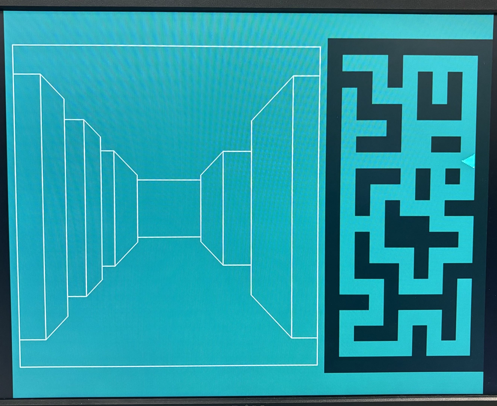

# Mazewar

**First-person 3D maze game rendered in hardware on a DE1-SoC FPGA.**

There is no CPU or soft core in the design. Every pixel comes from a state machine written in SystemVerilog, driving a 640×480 VGA display. The renderer uses no DSP blocks, because it performs no multiplication or division at runtime.


<p align="center">
  
</p>

<p align="center"><em>Running on hardware. <a href="doc/media/demo.mov">Full video</a>.</em></p>

---

## What it is

A hardware reimplementation of [Mazewar](https://en.wikipedia.org/wiki/Maze_War) (1973), built as a digital design course project. You walk an 11×21 maze in first person, with a live top-down minimap showing position and facing.

- Perspective-projected first-person view: corridors, corner openings, end walls
- Live 2D minimap with a directional player marker
- Grid collision detection, tested before movement commits
- 640×480 framebuffer at 9-bit color, 60 Hz
- Drawing primitives: Bresenham lines, filled rectangles and triangles, arbitrary quads

## Results

Post-fit, Quartus Prime 18.1 Lite, `5CSEMA5F31C6`:

| Resource | Used | Available | Utilization |
|---|---|---|---|
| Logic (ALMs) | 1,193 | 32,070 | **4%** |
| Registers | 1,137 | — | — |
| Block memory | 2,764,800 bits | 4,065,280 bits | **68%** |
| RAM blocks | 338 | 397 | **85%** |
| **DSP blocks** | **0** | 87 | **0%** |
| PLLs | 1 | 6 | 17% |
| I/O pins | 98 | 457 | 21% |

Timing at 50 MHz (slow 1100 mV 85 °C): setup slack **+6.987 ns**, hold slack +0.231 ns, TNS 0.000.

The framebuffer is 640 × 480 × 9 = 2,764,800 bits, which accounts for the whole block memory figure and 85% of the device's RAM blocks. Logic sits at 4%. The design is constrained by memory rather than area. There is no room for a second framebuffer, so double buffering would mean dropping color depth.

DSP usage is zero because the perspective projection is precomputed into a lookup table; [Perspective without arithmetic](#perspective-without-arithmetic) covers the reasoning. Timing closes with roughly 7 ns of margin because the FSM spreads drawing over many cycles instead of deep combinational paths.

## Hardware and controls

| | |
|---|---|
| **Board** | Terasic DE1-SoC |
| **FPGA** | Intel Cyclone V `5CSEMA5F31C6` |
| **Display** | VGA, 640×480 @ 60 Hz, 9-bit color |
| **Input** | PS/2 keyboard |
| **Clock** | 50 MHz `CLOCK_50`; pixel clock from PLL |

| Control | Action |
|---|---|
| <kbd>W</kbd> / <kbd>S</kbd> | Move forward / backward |
| <kbd>A</kbd> / <kbd>D</kbd> | Turn left / right |
| `SW[0]` | System reset |
| `SW[1]` | Reset player to start position |

---

## How it works

### Architecture

<!-- MEDIA: export doc/TopLevelDiagram.drawio to SVG at doc/media/architecture.svg -->
<p align="center">
  
</p>

| Module | Responsibility |
|---|---|
| `player` | Position and facing. Decodes input, tests the target cell, commits the move only if it is free. |
| `draw_screen` | The renderer. An 11-state FSM that walks the maze and emits geometry. |
| `vga_adapter` | Framebuffer and VGA timing. Accepts `(x, y, color)` writes. |

`player` publishes `px`, `py` and `direction`. `draw_screen` streams pixel writes into the framebuffer. Frames redraw only on movement, so the renderer is idle most of the time.

### Perspective without arithmetic

A raycaster casts one ray per screen column and divides to find each wall's projected height. That is 640 divisions per frame, and dividers are expensive in hardware.

We avoided it by exploiting a constraint the general algorithm ignores. On a grid, facing one of four directions, every visible wall sits at one of 16 discrete depths, so a wall edge can only ever land at one of 16 screen positions. Those are precomputed:

```systemverilog
parameter logic [12:0] Distance [0:15] = '{
    13'd35,  13'd65,  13'd90,  13'd111,   // depth 0-3
    13'd128, 13'd141, 13'd151, 13'd158,   // depth 4-7
    ...
};
```

The values crowd together as depth increases. That non-linear spacing is the perspective projection, evaluated once at design time rather than 640 times per frame. At runtime the renderer indexes the table and adds.

The quantisation is visible on screen. The left wall recedes in discrete steps rather than as a smooth taper, one step per table entry:

<p align="center">
  
</p>

Each frame, the FSM:

1. Clears the screen and redraws the minimap cell by cell
2. Walks forward from the player to find how far the corridor extends
3. Walks the left wall, counting runs of consecutive same-type cells and emitting one quad per run. A five-cell wall costs one quad.
4. Walks the right wall, mirroring the same logic
5. Draws the viewport frame and the end wall

Run-length merging keeps the primitive count inside the frame budget.

### Primitives

Everything reduces to one pixel-per-clock line engine:

| Primitive | Implementation |
|---|---|
| `draw_line` | Bresenham, Zingl's integer formulation. One pixel per clock. |
| `draw_rectangle_fill` | Scanline fill: one horizontal line per row |
| `draw_triangle_fill` | Minimap player marker |
| `draw_quad` | Four chained `draw_line` calls. The wall bands. |

Each is its own FSM behind a uniform `start`/`busy`/`done` handshake, so `draw_screen` composes them without tracking timing.

### Collision

The maze is 21 rows of 11 bits, one bit per cell. Movement is one cell along one axis, so collision is a single lookup tested before the move commits:

```systemverilog
if (map[py + forward_y][px + forward_x] == 0) begin
    px <= px + forward_x;
    py <= py + forward_y;
end                       // else: move rejected, position holds
```

`forward_x` and `forward_y` decode combinationally from the 2-bit `direction`, so three lines cover all four facings.

---

## Repository layout

```
├── code Submit/          Final submitted design, canonical source
│   ├── game_top.sv           Top level: player + renderer + VGA adapter
│   ├── player.sv             Position, facing, collision
│   ├── draw_screen.sv        The rendering FSM
│   ├── draw_quad.sv          Wall-band primitive
│   ├── draw_line.sv          Bresenham line engine
│   └── draw_rectangle_fill.sv
├── src/                  Development tree: full primitive set, earlier iterations
│   ├── draw/                 draw_triangle_fill, draw_polygon, draw_rectangle, ...
│   ├── vga_adapter/          DE1-SoC VGA driver and PLL
│   └── MIF/                  Memory initialisation files
├── test/                 ModelSim testbenches, one per module
├── project/              Quartus project (.qpf/.qsf) and prebuilt bitstream
├── doc/                  Design diagrams and original proposal
└── Fun Version/          Bitstream snapshots from development
```

## Build and run

Requires Quartus Prime 18.1 Lite, a DE1-SoC, a VGA monitor and a PS/2 keyboard.

To flash the prebuilt bitstream:

1. Connect over USB-Blaster and power on
2. Quartus → **Tools → Programmer**
3. Select `project/vga_demo.sof`, then **Start**

To build from source, open `project/vga_demo.qpf`, run **Processing → Start Compilation**, and program the resulting `.sof` as above. Pin assignments are already in the `.qsf`.

The top-level module is still named `vga_demo`, inherited from the Terasic template the project started from. If you rename it, update `TOP_LEVEL_ENTITY` in the `.qsf` to match.

## Simulation

Each module has a ModelSim testbench under `test/` with a `.do` script that compiles, loads waveforms and runs stimulus:

| Directory | Covers |
|---|---|
| `test/draw_screen_test/` | Rendering FSM end to end |
| `test/player_test/` | Movement, turning, collision rejection |
| `test/trig_test/` | Sine LUT from the earlier trig approach |
| `test/vertex_RAM_test/` | Vertex RAM read path |
| `test/vertex_load_test/` | Vertex loader |

```tcl
cd test/draw_screen_test
do tb_draw_screen.do
```

<!-- MEDIA (optional): ModelSim waveform screenshot at doc/media/waveform.png -->

---

## Design evolution

The design that shipped is not the one proposed.

The proposal (`doc/Schematic.drawio`) described a conventional raycaster: one ray per column, compute distance, divide for projected height, write one column per cycle. It called for a `Ray_Caster`, a `Distance_Calculator`, a `Column_Update` block and two clock domains.

Arithmetic cost killed it. Per-column projection needs division 640 times per frame, which means either many dividers or many stalled cycles. An early attempt using a sine lookup table survives in `test/trig_test/`.

What shipped (`doc/TopLevelDiagram.drawio`) replaced the per-column maths with the 16-entry LUT and run-length-merged quads.

Things we would change:

- **Free-angle movement.** The LUT is what makes the design cheap and what locks the player to a grid and four facings. Supporting arbitrary angles means going back to real projection arithmetic, trading area for freedom.
- **Merging the mirrored FSM states.** `INITLEFT`/`DRAWLEFT` and `INITRIGHT`/`DRAWRIGHT` differ mainly in sign. Parameterising one path would roughly halve the state machine.
- **One source of maze truth.** The map is declared identically in both `player` and `draw_screen`.
- **Double buffering**, if color depth were cut to free the RAM.

---

## Credits and license

The drawing primitives derive from the [Project F](https://projectf.io) Verilog library by Will Green (MIT): the line, rectangle and triangle engines. `draw_quad` extends Project F's rectangle module to arbitrary quadrilaterals. The line algorithm follows [Alois Zingl's formulation](http://members.chello.at/~easyfilter/bresenham.html).

The VGA adapter, address translator and PLL are University of Toronto / Terasic DE1-SoC reference components.

The renderer, the LUT approach, the player and collision logic and the system integration are my own work. Built as a course project with one collaborator.

MIT licensed. See [LICENSE](LICENSE).
